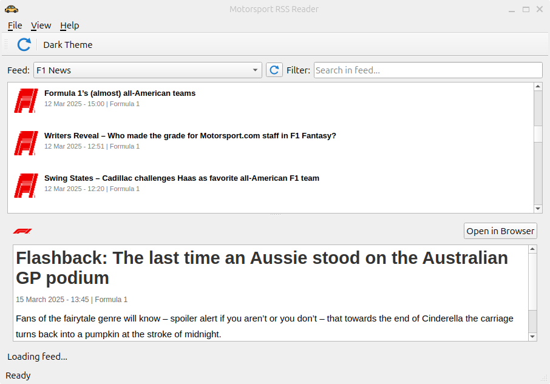

# Motorsport RSS Reader

A modern, cross-platform RSS feed reader for motorsport news. This application allows you to stay up-to-date with the latest news from various motorsport series including Formula 1, MotoGP, NASCAR, WRC, and more.



## Features

- Clean, modern user interface
- Support for multiple motorsport news feeds
- Categorized news items with league logos
- Article preview with images
- Dark theme support
- Search and filter capabilities
- Open articles in your default browser

## Supported Feeds

- Motorsport.com
- Autosport
- Formula 1 News
- MotoGP News
- NASCAR News
- WRC News
- Formula E News

## Installation

### Ubuntu/Debian

```bash
# Install dependencies
sudo apt-get update
sudo apt-get install -y qt5-default libqt5svg5 libqt5network5 libqt5xml5

# Install the application
sudo dpkg -i motorsportrss_1.0.0_amd64.deb
```

### Fedora/RHEL/CentOS

```bash
# Install dependencies
sudo dnf install qt5-qtbase qt5-qtsvg qt5-qtbase-gui

# Install the application
sudo rpm -i motorsportrss-1.0.0.x86_64.rpm
```

### Windows

1. Download the installer (MotorsportRSS-1.0.0-win64.exe)
2. Double-click to run the installer
3. Follow the installation wizard

### AppImage (Linux universal package)

1. Download MotorsportRSS-1.0.0-x86_64.AppImage
2. Make executable: `chmod +x MotorsportRSS-1.0.0-x86_64.AppImage`
3. Run: `./MotorsportRSS-1.0.0-x86_64.AppImage`

## Building from Source

### Requirements

- Qt 5.12 or higher
- C++11 compatible compiler
- CMake 3.10 or higher (optional)

### Build Instructions

```bash
# Clone the repository
git clone https://github.com/yourusername/motorsportrss.git
cd motorsportrss

# Build using qmake
qmake
make

# Or build using CMake
mkdir build && cd build
cmake ..
make
```

## Packaging

### Debian/Ubuntu Package

```bash
# Install packaging tools
sudo apt-get install -y debhelper

# Generate the package
dpkg-buildpackage -us -uc -b
```

### RPM Package

```bash
# Install packaging tools
sudo dnf install rpm-build

# Generate the package
rpmbuild -ba motorsportrss.spec
```

### AppImage

```bash
# Install linuxdeployqt
sudo apt-get install -y fuse libfuse2

# Generate AppImage
./linuxdeployqt.AppImage MotorsportRSS -appimage
```

### Windows Installer

```bash
# Install NSIS
# Build the installer script
makensis motorsportrss.nsi
```

## Publishing to Desktop App Stores

### Linux App Centers

1. Flathub (Flatpak)
   - Create a manifest file (org.yourusername.MotorsportRSS.json)
   - Follow submission guidelines at https://docs.flathub.org/

2. Snap Store
   - Create a snapcraft.yaml file
   - Follow submission guidelines at https://snapcraft.io/docs/publishing-to-the-snap-store

### Windows Store

1. Register as a developer at https://developer.microsoft.com/
2. Use the Windows App Certification Kit to test your app
3. Package your app as MSIX
4. Submit through the Developer Dashboard

## License

This project is licensed under the MIT License - see the LICENSE file for details.

## Acknowledgments

- All the motorsport news providers for their RSS feeds
- The Qt project for the amazing framework
- Various open-source projects that inspired this work 